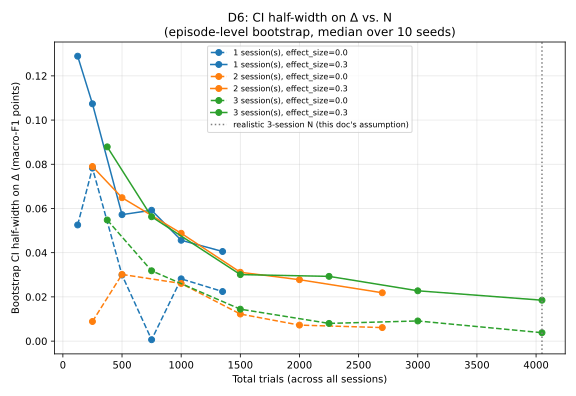
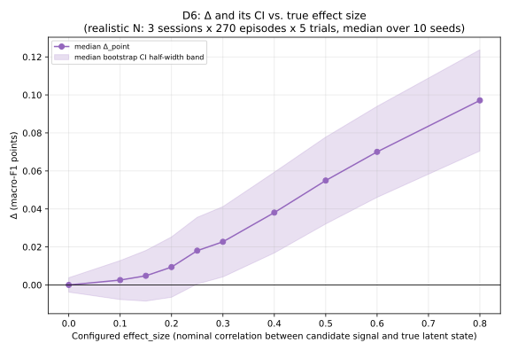
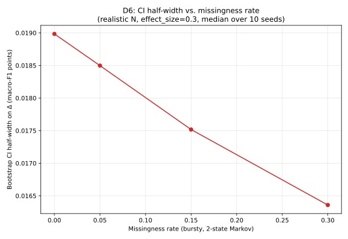

# D6 Precision Analysis — v1

**Date:** 2026-08-30
**Status:** Pass 1. Synthetic simulation only — no real subject data exists yet (D2 is blocked).
**Governing guardrails:** G1 (no verdicts — this document computes and reports numbers,
never RETAIN/DROP/INCONCLUSIVE), G2 (no assumption here was adjusted after seeing a
result), G3 (gaps and invented numbers are named explicitly, not smoothed over).
**Code:** `simulation/generator.py`, `simulation/precision.py`, `simulation/run_precision_sweep.py`.
**Full assumption documentation:** `docs/D6_SIMULATION.md` — read that document before
trusting any number below; every parameter's justification (or admission that there is
none) lives there.

---

## 1. The question, stated plainly

The study terminates in a three-way verdict per component, comparing a difference in
utility Δ (proposed primary metric: macro-F1) between two models against a threshold δ:

```
RETAIN        lower bound of CI on Δ  >  δ
DROP          upper bound of CI on Δ  <  δ
INCONCLUSIVE  CI spans δ
```

**Before spending three sessions of one subject's time collecting real data, how wide
will the confidence interval on Δ be — and does that width even allow RETAIN or DROP to
be reachable, for the δ values currently under consideration, or is INCONCLUSIVE forced
by arithmetic regardless of what the real data show?**

This document answers that question using entirely synthetic data. It does not, and
cannot, say anything about whether a real candidate representation (V_es, V_pd,
attention, or anything else) actually carries predictive information about a real
subject's real subsequent action — that comparison has never been run, and D2 (which
real action classes exist) is still blocked.

---

## 2. Generator assumptions (summary — full detail in docs/D6_SIMULATION.md)

| # | Mechanism | Model | Key parameter(s) (Pass-1 value) | Status |
|---|---|---|---|---|
| A1 | Serial dependence | AR(1) latent propensity `z_t`, restarts each session | `ar1_phi=0.6` | INVENTED |
| A2 | Learning | `gamma_t` (z's pull on class) grows, saturating, across the WHOLE STUDY | `learning_gain=0.5`, half-life 200 trials | INVENTED |
| A3 | Fatigue | AR(1) innovation std inflates WITHIN a session, resets each session | `fatigue_gain=0.5` | INVENTED |
| A4 | Class-frequency drift | zero-sum logit drift within a session | `class_drift_rate=0.3` | INVENTED |
| A5 | Missingness | bursty 2-state Markov chain (exact analytic solve, not IID dropout) | rate `0.05` (swept 0–0.30), mean run length `5.0` trials | INVENTED, loosely anchored to this repo's soak-test reliability |
| A6 | True effect size | candidate signal = noisy observation of `z_t`, rescaled toward unit variance | swept `0.0`–`0.8` | INVENTED range; `0.0` = verified true null |

**Hierarchy and realistic-N anchor (§7 of docs/D6_SIMULATION.md):** in the absence of a
defined D2 trial/episode, 1 episode is anchored to the existing (also provisional)
10-second rolling window (`features/episodes.py`), and 1 trial to 1 on-screen action
opportunity within it. **1 trial ≈ 2s, 5 trials/episode, 270 episodes/session (45 minutes
of active task time), 3 sessions → 4,050 total trials.** These four numbers are
INVENTED and are the load-bearing assumptions behind every "achievable N" claim below.

---

## 3. Sweep results

Classifier: multinomial logistic regression (`simulation/models.py`), L2 chosen from
`{0.1, 1.0, 10.0}` on a validation split. Chronological 60/20/20 train/val/test split,
episode-respecting. Bootstrap: 800 replicates, resampled at the **episode** level (never
trial-level — CLAUDE.md D0PA1 hard constraint #4), 95% CI. Every number below is the
**median over 10 independent seeds** (common random numbers across sweep points within
one dimension) — a single seed's result is noisy enough (see §3.3) that reporting one
draw would be misleading.

### 3.1 CI half-width vs. N (the primary curve, B4/B6)



At a fixed moderate, clearly-nonzero effect size (`effect_size=0.3`, realized
correlation ≈0.37 — see docs/D6_SIMULATION.md's calibration note):

| Sessions | Episodes/session | Total trials | median Δ | median CI half-width | seeds w/ CI excl. 0 |
|---|---|---|---|---|---|
| 1 | 25  | 125  | +0.009 | 0.129 | 0/10 |
| 1 | 100 | 500  | +0.033 | 0.057 | 2/10 |
| 1 | 270 | 1350 | +0.032 | 0.041 | 4/10 |
| 2 | 100 | 1000 | +0.023 | 0.049 | 2/10 |
| 2 | 270 | 2700 | +0.025 | 0.022 | 6/10 |
| 3 | 100 | 1500 | +0.010 | 0.030 | 2/10 |
| **3** | **270** | **4050** | **+0.023** | **0.019** | **5/10** |

(Full 36-row table in `artefacts/d6_sweep_results.json`.) The bold row is the design
point this study is actually planning: **3 sessions, 270 episodes/session — the median
achievable CI half-width on Δ is ≈0.019 macro-F1 points.**

### 3.2 Δ and CI vs. true effect size, at the realistic N



| effect_size (nominal) | realized corr(signal, z) | median Δ | median CI half-width | seeds w/ CI excl. 0 |
|---|---|---|---|---|
| 0.00 | ~0.00 | +0.000 | 0.004 | 1/10 |
| 0.10 | 0.14 | +0.003 | 0.010 | 3/10 |
| 0.20 | 0.28 | +0.009 | 0.016 | 3/10 |
| 0.25 | 0.35 | +0.018 | 0.018 | 5/10 |
| 0.30 | 0.37 | +0.023 | 0.019 | 5/10 |
| 0.40 | 0.49 | +0.038 | 0.021 | 8/10 |
| 0.50 | 0.60 | +0.055 | 0.023 | 9/10 |
| 0.60 | 0.68 | +0.070 | 0.024 | 10/10 |
| 0.80 | 0.85 | +0.097 | 0.027 | 10/10 |

### 3.3 CI half-width vs. missingness rate, at the realistic N and effect_size=0.3



| Missingness rate | median Δ | median CI half-width |
|---|---|---|
| 0.00 | +0.020 | 0.019 |
| 0.05 (realistic) | +0.023 | 0.019 |
| 0.15 | +0.019 | 0.018 |
| 0.30 | +0.018 | 0.016 |

**This table looks backwards at first glance — CI half-width goes DOWN as missingness
goes UP — and the correct reading is important, not reassuring.** Missingness does not
make the estimate more PRECISE; it makes the estimate SMALLER. As more of the candidate
signal is imputed away, the "with" model has less real information to differentiate
itself from the "without" model, so the point estimate Δ shrinks toward zero — and its
sampling variability shrinks in proportion, because there is less for the extra feature
to "do." **The true cost of missingness here is a shrinking, harder-to-detect Δ, not a
wider interval** — reporting CI half-width alone would understate that cost. A real
effect that would otherwise be detectable can be pushed toward invisible by missingness
without the confidence interval ever visibly widening to warn you.

### 3.4 A visible limitation in this pipeline itself: exact-zero degeneracy near the null

At `effect_size=0.0` (§3.1's null-reference rows, not shown in the table above but in
the full JSON and the dashed lines of Figure 1), several individual seeds produced a CI
half-width of **exactly, or almost exactly, zero** (e.g., 3 sessions × 150
episodes/session: median half-width 0.008, but individual seeds hit values as low as
0.0000). This is not a bug: `simulation/precision.py`'s Δ is computed from **hard
classification decisions** (argmax), per the task's specified macro-F1 metric. When a
candidate signal carries no real information, the "with" and "without" models can
produce **byte-identical predictions** on every single test trial (verified directly —
both collapsed to predicting the majority class on every trial in one such case), which
makes Δ exactly 0.0 with exactly zero bootstrap variance on that draw. Averaging over 10
seeds smooths this considerably but does not eliminate it — the dashed (`effect_size=0.0`)
lines in Figure 1 are visibly non-monotonic and noisier than the solid
(`effect_size=0.3`) lines for exactly this reason. **Do not read the null-case curve as
"achievable precision at zero effect"; read the moderate-effect (solid) curve as the
reliable one, and treat the null-case rows as evidence that this specific
hard-decision metric can occasionally produce artificially tight-looking null results**
— a caution for interpreting any single real result near zero, not just this simulation.

---

## 4. Headline

**At the N this study can realistically collect from one subject across three sessions
in a 20-working-day window (≈4,050 trials, per the assumptions in §2), the median
achievable bootstrap CI half-width on Δ is ≈0.019 macro-F1 points** (range across the
sweep's realistic-N-adjacent points: roughly 0.016–0.024, depending on missingness and
the true effect size itself).

**The smallest Δ reliably distinguishable from zero at this N** — reading "reliably" as
the effect size where most (not just half) of the 10 seeds produced a CI excluding
zero — is around **effect_size ≈ 0.4–0.5, corresponding to a true Δ of roughly 0.04–0.06
macro-F1 points** (§3.2: 8/10 and 9/10 seeds excluded zero at those points). Below
`effect_size≈0.25` (Δ≈0.02), fewer than half the seeds produced a CI excluding zero —
meaning a real effect of that size or smaller would be COIN-FLIP odds, at best, to even
register as different from zero, let alone clear a δ threshold.

---

## 5. WHAT THIS MEANS FOR THE THRESHOLDS

Candidate δ values under consideration (macro-F1 points), and the arithmetic — **stated
as arithmetic, not a recommendation to accept, reject, or change any of them**:

| Candidate | Value | Achievable CI half-width at realistic N (≈0.019, §4) | Arithmetic |
|---|---|---|---|
| `δ_Gate3` | 0.05 | 0.019 | δ is ≈2.6× the CI half-width. If the true Δ lands clearly above or below 0.05 (roughly Δ<0.03 or Δ>0.07), the CI is narrow enough to plausibly avoid straddling δ, allowing RETAIN or DROP. If the true Δ lands within roughly ±0.019 of 0.05 (i.e., 0.031–0.069), the CI can straddle δ and force INCONCLUSIVE. |
| `δ_attention` | 0.03 | 0.019 | δ is only ≈1.6× the CI half-width. A true Δ anywhere in roughly 0.011–0.049 can produce a CI that straddles 0.03 — a substantially wider "INCONCLUSIVE zone", proportionally, than δ_Gate3's. |
| `δ_latent` | 0.03 | 0.019 | Identical arithmetic to δ_attention (same value). |

**In plain terms:** a CI half-width of ≈0.019 means any true Δ within about ±0.019 of a
candidate δ produces a straddling interval, i.e. INCONCLUSIVE, by construction —
independent of what the real data actually show. δ_Gate3 (0.05) has more room around it
proportionally than δ_attention/δ_latent (0.03, both only ~1.6× the CI half-width). None
of the three candidate δ values is "unreachable" outright — RETAIN/DROP remain possible
outcomes for all three, if the true Δ happens to fall clearly outside the ≈0.019-wide
straddling zone around it — but for δ_attention and δ_latent specifically, that
straddling zone (≈0.011 to ≈0.049) covers a wide and entirely plausible range of true
effect sizes for this kind of signal, based on nothing more than this simulation's own
swept range (§3.2 shows real, correctly-detected effects starting well within that
band). **This simulation cannot say what the real Δ will be. It can say that if the
real Δ turns out to be small-to-moderate — which is exactly the range V_es/V_pd's own
POC-stage reliability tags (LOW/MEDIUM) would suggest is plausible — INCONCLUSIVE is a
live, arithmetic possibility for δ_attention and δ_latent at this N, not just a
hypothetical one.**

---

## 6. Limitations

- **This is a simulation under stated, largely invented assumptions.** No real
  behavioral or action data informs any generator parameter — none exists yet (D2 is
  blocked). See docs/D6_SIMULATION.md §3 for every value and its (non-)justification.
- **The realistic-N anchor (1,350 trials/session) is itself invented**, built by
  analogy to the repo's existing provisional 10-second episode unit, not from any
  measurement of a real trial's duration. If the client's real answer to D2 implies a
  different trial rate or session length, every number in §3–§5 should be re-derived
  (the simulation code does not need to change, only the `GeneratorConfig` values fed
  into it — see docs/D6_SIMULATION.md §7).
- **The bootstrap resamples the test set's evaluation, not the full train-then-evaluate
  procedure** (§6 of docs/D6_SIMULATION.md) — a disclosed computational simplification
  that likely UNDERSTATES the true CI width somewhat, meaning real achievable precision
  is probably slightly WORSE than reported here, not better.
- **Only a simple multinomial logistic regression was tested.** A more expressive model
  family (still within the project's permitted scope) could extract more signal from
  the same N, changing the achievable Δ at a given sample size — this Pass 1 does not
  sweep over model family.
- **§3.4's exact-zero degeneracy** is a property of comparing hard classification
  decisions under macro-F1 (the task-specified metric) with a simple model; it is not
  fully eliminated by 10-seed averaging and means individual near-null results (in this
  simulation OR in a future real analysis using the same metric) can occasionally look
  more precise than they really are.
- **A1–A6 were swept along three separate axes (N, effect size, missingness), not
  jointly** — interactions between e.g. fatigue and missingness, or learning and class
  drift, are not separately characterized in this Pass 1.
- **Real data may differ from every assumption above** in ways this simulation cannot
  anticipate. This document narrows the question to "is the design powered enough for
  ANY answer to be decidable" — it is not a prediction of what the real study will find.
