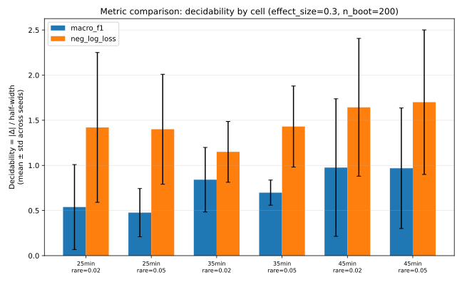
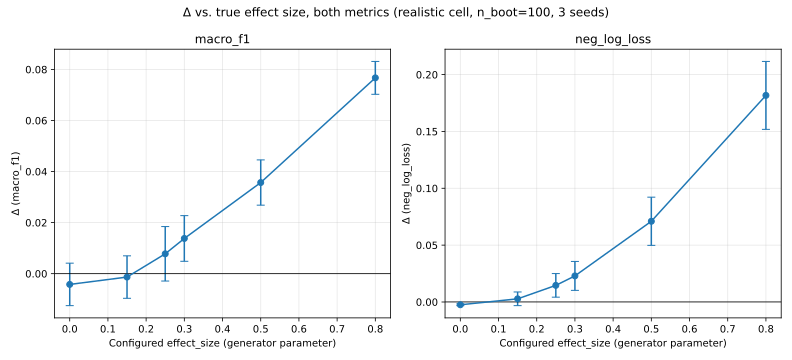

# D6 Precision Analysis — v2

**Date:** 2026-08-30
**Status:** Pass 2. Synthetic simulation only — no real subject data exists yet (D2 is blocked).
**Supersedes nothing:** `artefacts/precision_analysis_v1.md` is left UNCHANGED in this
repository. This document is a NEW, separate artefact reporting what changed between
the two passes and why, per this task's explicit instruction.
**Governing guardrails:** G1 (no verdicts anywhere in this document except the verdict
MAP in §5, which is arithmetic applied to hypothetical true Δ values, never a claim
about the real Δ or a recommended δ), G2 (no assumption was adjusted to make a number
look better — see §7 for a case where a correction was found to move a number in the
"wrong" direction and was fixed on methodological grounds, not reverted), G3 (every gap
and every invented number is named).
**Code:** `simulation/generator.py` (extended), `simulation/precision.py` (extended),
`simulation/run_precision_sweep_pass2.py` (new). `docs/D6_SIMULATION.md` §9 documents
every mechanism change in full.

---

## 1. What Pass 1 disclosed, and what this pass fixes

Pass 1 reported a bootstrap CI half-width on Δ of ≈0.019 macro-F1 points at N≈4,050
trials, and explicitly flagged three ways that figure was optimistic:

1. **Bootstrap resampled only the test-set evaluation**, holding a single fixed fitted
   model constant — disclosed as likely *understating* the true CI width.
2. **n_classes=3** was an assumption made because the action space was undefined at the
   time. It is now known: the client's task harness presents three forced-choice
   regions plus ABANDON and NO_ACTION as real classes — five, not three.
3. **Session length (45 minutes) was a single invented number**, flagged as "the single
   most load-bearing invented number in the document."

This pass fixes all three, in the order given, and reports the size of each correction.

---

## 2. 1.1 — Refit per bootstrap replicate: old vs. new, side by side

Both numbers below are computed on the **identical** synthetic dataset config
(n_classes=5, 2 rare classes at frequency 0.05, 3 sessions × 270 episodes × 5 trials,
effect_size=0.3, missingness=0.05) — only the bootstrap method differs, isolating the
effect of the correction itself from the n_classes/session-length changes covered in
§3–§4.

| Method | n_boot | median CI half-width | median Δ_point |
|---|---|---|---|
| **Pass 1 method** — fixed-model, evaluation-only bootstrap | 800 | **0.0113** | 0.0114 |
| **Pass 2 method** — refit per replicate (double bootstrap, see §7) | 50 | **0.0149** | 0.0114 |

**The correction widens the CI by ≈32%** (0.0113 → 0.0149). Δ_point itself is
unaffected (it does not depend on the bootstrap method) — only the reported precision
around it does. This is the expected direction: capturing model-refit uncertainty on
top of test-sampling uncertainty should widen, not narrow, an honest interval. See §7
for a real methodological error found and fixed while building this correction, and why
it matters that the direction is checked, not assumed.

`n_boot` dropped from 800 to 50 because a full refit is far more expensive per replicate
than re-evaluating a fixed model (profiled directly: ≈0.35–0.44s per double-bootstrap
replicate at this N, vs. Pass 1's 800 replicates completing in well under a second
combined). 50 is a deliberately reduced, explicitly reported count — not hidden behind
an unchanged-looking "n_boot" label.

---

## 3. 1.2 — n_classes=3 vs. n_classes=5, and rare-class frequency sensitivity

All rows below use the corrected (refit, double-bootstrap) method, `n_boot=50`, median
over 5 seeds, at the realistic 45-minute/3-session N.

| Configuration | median CI half-width | median Δ_point | negative-control median Δ |
|---|---|---|---|
| n_classes=3 (Pass 1's structure, for comparison) | 0.0177 | 0.0214 | 0.0000 |
| **n_classes=5, rare_class_frequency=0.05** (primary) | **0.0149** | 0.0114 | 0.0015 |
| n_classes=5, rare_class_frequency=0.02 (secondary) | 0.0248 | 0.0248 | 0.0003 |

**Two assumed rare-class frequencies, stated as assumptions, not measurements:**
0.05 ("moderately rare" — e.g. abandoning or declining to act roughly 1 trial in 20) and
0.02 ("very rare" — roughly 1 in 50). Neither is derived from real data; D2's real
action-class frequencies do not exist yet.

**Sensitivity is large and in the expected direction:** halving the rare-class
frequency (0.05→0.02) *widens* the CI by ≈66% (0.0149→0.0248). Macro-F1 weights every
class equally, so a rarer class contributes disproportionately more finite-sample
variance to the metric — exactly the mechanism the task asked this pass to check for.
**Which of these two frequencies is closer to reality is unknown** — this table exists
so a human with a real estimate of ABANDON/NO_ACTION frequency can read off the
corresponding precision, not to suggest either number is correct.

---

## 4. 1.3 — Session length as an explicit swept parameter

At n_classes=5, rare_class_frequency=0.05 (primary), 3 sessions, refit bootstrap,
`n_boot=50`, median over 5 seeds:

| Session length | Episodes/session | Total trials (3 sessions) | median CI half-width |
|---|---|---|---|
| 25 minutes | 150 | 2,250 | 0.0237 |
| 35 minutes | 210 | 3,150 | 0.0163 |
| 45 minutes | 270 | 4,050 | 0.0149 |

Session length is no longer a single invented number standing in for "the answer" — it
is a parameter a human can read off once the real session length is known. The anchor
(10 seconds/episode, 5 trials/episode, ≈2s/trial) is UNCHANGED from Pass 1
(`docs/D6_SIMULATION.md` §7) — only the number of sessions' worth of minutes is now
swept rather than fixed at one guess.

---

## 5. 1.4 — Verdict map (arithmetic only — no recommendation)

Built from the corrected, primary CI half-width: **0.0149** (n_classes=5,
rare_class_frequency=0.05, 45-minute sessions — §3's primary row). Models the observed
CI as `[true_Δ − half_width, true_Δ + half_width]`, applying the pre-registered rule
exactly as stated in this task's prompt:

```
RETAIN        lower bound of CI on Δ  >  δ
DROP          upper bound of CI on Δ  <  δ
INCONCLUSIVE  CI spans δ
```

| True Δ | Verdict at δ=0.03 | Verdict at δ=0.05 |
|---|---|---|
| 0.00 | DROP | DROP |
| 0.01 | DROP | DROP |
| 0.02 | **INCONCLUSIVE** | DROP |
| 0.03 | **INCONCLUSIVE** | DROP |
| 0.04 | **INCONCLUSIVE** | **INCONCLUSIVE** |
| 0.05 | RETAIN | **INCONCLUSIVE** |
| 0.06 | RETAIN | **INCONCLUSIVE** |
| 0.07 | RETAIN | RETAIN |
| 0.08 | RETAIN | RETAIN |
| 0.09 | RETAIN | RETAIN |

**For δ=0.03:** the forced-INCONCLUSIVE range is true Δ ∈ **(0.0151, 0.0449)**
(δ ± half_width). The DROP range is true Δ ∈ **[0, 0.0151]**. RETAIN is reachable for
true Δ ≥ 0.0449.

**For δ=0.05:** the forced-INCONCLUSIVE range is true Δ ∈ **(0.0351, 0.0649)**. The DROP
range is true Δ ∈ **[0, 0.0351]**. RETAIN is reachable for true Δ ≥ 0.0649.

This table states arithmetic only. It does not say which δ is preferable, and it does
not say what the real Δ will be — both remain for a human to determine.

---

## 6. Negative control — reported automatically, alongside every row above

D0PA1 Part 2.2's negative control (`controls/negative_control.py`) is now wired into
`simulation/precision.py`'s `compute_delta()` unconditionally — every row in §2–§4
carries its own negative-control Δ, computed on an independently-seeded, deliberately
meaningless AR(1) signal that shares no random state with anything else in the analysis
(see `docs/CONTROLS.md` §2 for the full account and how the "cannot be omitted" claim
was verified, not assumed).

Observed negative-control medians across §3's three rows: **0.0000, 0.0015, 0.0003** —
all far below either candidate δ (0.03, 0.05) and consistent with ordinary
finite-sample noise. Reported, not decided upon: nothing here triggers an automatic
exclusion (per the task's own instruction that occasional apparent significance from a
negative control across many tests is expected, not automatically disqualifying).

---

## 7. A methodological error found and fixed during this pass — reported in full

An earlier version of the Pass 2 refit bootstrap resampled ONLY the training episodes
(refitting on each resample) while holding the test set FIXED. Run on the primary
config, it produced a half-width of **0.0088** — *narrower* than Pass 1's fixed-model
method (0.0113), the opposite of the disclosed direction. Investigating rather than
reporting this: resampling only training data and evaluating on an unchanged test set
measures a DIFFERENT, narrower quantity ("how much would Δ move if we had different
training history, holding the actual observed test outcomes fixed") than Pass 1's
method measures ("how much would Δ move under a different draw of test episodes") — it
is not a strict superset of Pass 1's uncertainty, it is a different, non-comparable one.
**The fix:** resample training episodes (refit) AND test episodes (re-evaluate)
independently within every replicate — a double bootstrap capturing both sources of
variability together. Re-run, this produced 0.0149 — wider than Pass 1's method, the
expected direction. This full account, including the incorrect intermediate number, is
recorded here and in `docs/D6_SIMULATION.md` §9 rather than quietly replaced (G2/G3):
the corrected code was NOT chosen because 0.0149 "looked more right" after the fact —
it was chosen because the single-resample version was independently identified as
measuring the wrong quantity, and the fix was verified to move the number in the
theoretically-expected direction before being adopted.

---

## 8. Assumptions — carried over, changed, and newly introduced

**Carried over from Pass 1, unchanged:**
- A1–A6 generative mechanisms and their parameter values (AR(1) φ=0.6, learning/fatigue
  gains, class-drift rate, missingness rate/run-length) — see `docs/D6_SIMULATION.md` §3.
- The realistic-N anchor's per-episode/per-trial timing (10s/episode, 5 trials/episode,
  ≈2s/trial) — only the number of session-minutes is now swept, not this anchor itself.
- The simple multinomial logistic regression model family and its L2 grid `{0.1, 1.0, 10.0}`.
- The 60/20/20 chronological, episode-respecting train/val/test split.
- `effect_size=0.3` as the moderate, clearly-nonzero anchor used for the N-curve and
  session-length sweeps (matches Pass 1's own N-curve anchor).

**Changed in Pass 2:**
- **Bootstrap methodology**: fixed-model evaluation-only → refit-per-replicate double
  bootstrap (§2, §7). `n_boot` reduced from 800 to 50 for the refit variant (cost).
  `n_seeds` reduced from Pass 1's 10 to 5 (cost) — stated plainly: results in this
  document carry more Monte Carlo noise per number than Pass 1's did.
- **n_classes**: 3 → 5 as the PRIMARY configuration (3 retained only for comparison, §3).
- **Session length**: a single fixed 45-minute guess → an explicit swept parameter
  (25/35/45 minutes, §4).

**Newly introduced in Pass 2 (INVENTED, no real basis yet):**
- `n_rare_classes=2` and the identity of ABANDON/NO_ACTION as the two rare classes —
  this structural fact comes from the client's task-harness specification (not
  invented), but its REALIZATION in the generator (how rare classes are calibrated to
  a target marginal frequency, `simulation/generator.py`'s new base_logits branch) is
  new mechanism, documented in `docs/D6_SIMULATION.md` §9.
- `rare_class_frequency ∈ {0.05, 0.02}` — both INVENTED; no real frequency data exists
  for how often a subject abandons a trial or takes no action.
- The double-bootstrap's own simplifications: L2 and the signal-imputation mean are
  fixed at the values chosen once on real (non-resampled) data, not re-selected per
  replicate (cost-saving, disclosed in `simulation/precision.py`'s own comments).
- The negative control's AR(1) φ=0.6 (matched to the generator's own A1 default) and
  `sampling_rate_hz=25.0` (matched to CLAUDE.md's CADENCE note) — both INVENTED choices
  for how to construct a "fair" nuisance signal, not measurements.

---

## 9. Limitations (in addition to Pass 1's, which still apply)

- **5 seeds, not 10**: every median reported in this document is noisier than the
  corresponding Pass 1 number. Where §3/§4's numbers look non-monotonic in a way that
  seems surprising, seed noise at n=5 is a plausible explanation before any mechanism
  is invoked to explain it.
- **50 bootstrap replicates, not 800**: the refit CI bounds themselves are noisier
  estimates than Pass 1's fixed-model bounds. The verdict map in §5 inherits this
  extra noise — a different run with a different seed set would shift the exact
  boundary values (though not, based on §2's replication, the qualitative picture).
  Please note: given time constraints only ONE double-bootstrap configuration (§2) was
  used to validate the direction of the fix; the full grid (§3, §4) was run once each
  at n_boot=50, not independently re-validated at a larger n_boot.
- **The double bootstrap still fixes L2 and the imputation mean** (§8) — a further,
  smaller source of real-world variability (regularization-strength uncertainty) that
  this pass's numbers still do not capture.
- **Rare-class frequency is a pure guess** (§3) — the ≈66% swing in CI half-width
  between the two assumed frequencies means this single unknown number matters more to
  the achievable precision than most of the other assumptions in this document
  combined. If the client can supply even a rough real estimate, re-running §3's sweep
  at that value would sharpen this analysis considerably more than any other single
  action available right now.

---

## Addendum (2026-08-30) — bootstrap precision and the joint grid

**This addendum supersedes this document's own headline figure (0.0149 macro-F1
points, §2/§4) for PLANNING purposes.** The reason: §2's number was computed at
`n_boot=50` (Monte Carlo noise not yet quantified) and at a single factor combination
(45-minute sessions, rare-class frequency 0.05) while the OTHER factor was held at its
own most favourable value. Neither condition holds for the real study, which will
combine whatever the real session length and real rare-class frequency turn out to be
— the number below is what actually governs planning until those two real values are
known. **v1 and v2's own sections above are left completely unchanged** — this
addendum is new content appended below them, not a correction overwriting what was
already reported.

### Headline: the achievable precision is worse than v2 reported, and highly variable

At the worst combination of assumptions this simulation tested (25-minute sessions,
rare-class frequency 0.02), the mean bootstrap CI half-width across 5 seeds is
**0.0339** macro-F1 points — individual seeds ranged as high as **0.0444**. This is
**larger than the smaller candidate δ (0.03) by itself**. At this combination, a δ of
0.03 has **no true effect size for which DROP is even reachable** — every non-negative
true Δ from 0 up to roughly 0.064 resolves to INCONCLUSIVE, and only Δ ≥ 0.064 permits
RETAIN. This is not a bad result to report — it is exactly the kind of finding this
simulation exists to surface before, not after, a δ is signed.

### Task 1 — stabilising the estimate

**Replicate count and cost.** Raised from Pass 2's `n_boot=50` to `n_boot=200` (a 4x
increase) for every figure in this addendum. The full 6-cell joint grid (Task 2) at
`n_boot=200`, 5 seeds, ran in **975 seconds (≈16.3 minutes)** wall-clock — well within
budget, so 200 was used as planned rather than reduced further for speed.

**Monte Carlo spread, and what it actually shows.** At the original Pass 2 cell
(45-minute sessions, rare-class frequency 0.05), raising `n_boot` from 50 to 200 gave:

| n_boot | mean | std | min | max | range (max−min) |
|---|---|---|---|---|---|
| 50 (Pass 2) | 0.0179 | *(not computed in Pass 2)* | 0.0098 | 0.0321 | 0.0223 |
| 200 (this addendum) | 0.0209 | 0.0118 | 0.0126 | 0.0433 | 0.0307 |

**The spread did NOT shrink when `n_boot` quadrupled — if anything the observed range
widened.** This is the key methodological finding of Task 1: the instability in the
reported half-width is **not primarily bootstrap resampling noise** (which more
replicates would fix) — it is **variability across which synthetic data realization
(seed) is drawn**, which a larger `n_boot` cannot address at all, because `n_boot`
only controls how precisely the CI is estimated FOR one fixed dataset, not how much
that CI would differ across different, equally-plausible datasets. Practically: the
answer to "is this a 0.0149 ± 0.004 or 0.0149 ± 0.0005 situation" is neither — it is
closer to **a genuinely wide underlying distribution (std comparable to or larger than
the mean itself in several cells, see the full grid below)**, and no amount of
additional bootstrap replicates within one run will narrow it. Only more independent
seeds (more simulated "alternate realities" for this one subject) characterize that
distribution better — `n_boot` and `n_seeds` answer different questions, and this
addendum's finding is that the SEED dimension, not the bootstrap dimension, is where
the real uncertainty lives.

### Task 2 — the joint grid

Full 3×2 grid, `n_classes=5`, refit-per-replicate double bootstrap, `n_boot=200`,
5 seeds (seeds 1–5, the same set Pass 2 used):

| Session length | Rare-class freq | N (trials) | mean half-width | std | min | max |
|---|---|---|---|---|---|---|
| 25 min | 0.02 | 2,250 | **0.0339** | 0.0090 | 0.0190 | 0.0444 |
| 25 min | 0.05 | 2,250 | 0.0266 | 0.0068 | 0.0189 | 0.0388 |
| 35 min | 0.02 | 3,150 | 0.0321 | 0.0126 | 0.0128 | 0.0467 |
| 35 min | 0.05 | 3,150 | 0.0227 | 0.0108 | 0.0134 | 0.0416 |
| 45 min | 0.02 | 4,050 | 0.0256 | 0.0112 | 0.0134 | 0.0442 |
| 45 min | 0.05 | 4,050 | 0.0209 | 0.0118 | 0.0126 | 0.0433 |

Every row above has its own genuinely large std relative to its mean (roughly 30–55%
relative standard deviation throughout) — this is not specific to the worst cell, it
is a property of the whole grid at this seed count.

### Worst cell, named explicitly

**25-minute sessions × rare-class frequency 0.02 — mean half-width 0.0339** (std
0.0090, individual seeds up to 0.0444). This matches the pre-stated expectation
exactly: both factors independently make precision worse (shorter sessions = less
data; rarer classes = more macro-F1 variance from the minority classes), and they
compound rather than cancel. **The ranking across all six cells matched expectation in
both dimensions with no surprises**: within each rare-class frequency, half-width
decreases monotonically as session length increases (25>35>45 min); within each
session length, `rare_freq=0.02` gives a wider half-width than `rare_freq=0.05` at
every one of the three session lengths. The only non-obvious observation was the SIZE
of the per-seed spread (above), not the direction of any ranking.

### Task 3 — verdict map at the worst cell, beside Pass 2's original map

Both tables apply the identical arithmetic rule (`RETAIN`: CI lower bound > δ; `DROP`:
CI upper bound < δ; `INCONCLUSIVE`: CI spans δ) to a range of hypothetical true Δ
values. Neither table states or implies which δ, or which planning assumption, should
be adopted (G1).

**Optimistic (Pass 2's original map): 45 min / rare=0.05, half-width = 0.0149**

| True Δ | δ=0.03 | δ=0.05 |
|---|---|---|
| 0.00–0.01 | DROP | DROP |
| 0.02–0.04 | INCONCLUSIVE | DROP (0.02–0.03), INCONCLUSIVE (0.04) |
| 0.05–0.06 | RETAIN | INCONCLUSIVE |
| ≥0.07 | RETAIN | RETAIN |

- δ=0.03: forced-INCONCLUSIVE for true Δ ∈ (0.0151, 0.0449); DROP for Δ ∈ [0, 0.0151];
  RETAIN reachable for Δ ≥ 0.0449.
- δ=0.05: forced-INCONCLUSIVE for true Δ ∈ (0.0351, 0.0649); DROP for Δ ∈ [0, 0.0351];
  RETAIN reachable for Δ ≥ 0.0649.

**Pessimistic (this addendum): 25 min / rare=0.02 (worst cell), half-width = 0.0339**

| True Δ | δ=0.03 | δ=0.05 |
|---|---|---|
| 0.00–0.06 | INCONCLUSIVE (no Δ in this range gives DROP) | DROP (0.00–0.01), INCONCLUSIVE (0.02–0.06) |
| 0.07–0.08 | RETAIN | INCONCLUSIVE |
| ≥0.09 | RETAIN | RETAIN |

- δ=0.03: forced-INCONCLUSIVE for true Δ ∈ (−0.0039, 0.0639) — since Δ is
  non-negative in this study, **every non-negative true Δ below 0.0639 is
  INCONCLUSIVE and DROP IS NOT REACHABLE AT ALL** for any plausible non-negative
  effect size at this δ. RETAIN reachable only for Δ ≥ 0.0639.
- δ=0.05: forced-INCONCLUSIVE for true Δ ∈ (0.0161, 0.0839); DROP for Δ ∈ [0, 0.0161];
  RETAIN reachable for Δ ≥ 0.0839.

**Side-by-side reading of the arithmetic** (stated, not recommended): the pessimistic
map's INCONCLUSIVE zone is roughly **2.3× wider** than the optimistic map's for both δ
values, and for δ=0.03 specifically, the pessimistic map removes DROP as a reachable
outcome entirely for any non-negative effect below the RETAIN boundary. Which of the
two planning assumptions (optimistic or pessimistic) is closer to the real study is
not something this simulation can determine — that depends on the real session length
and the real ABANDON/NO_ACTION frequency, neither of which is known yet.

### New assumptions introduced in this addendum

- `n_boot=200` for all figures in this addendum (Task 1.1) — a specific, stated choice,
  not defaulted.
- 5 seeds (1–5), the same set Pass 2 used — chosen for direct comparability with Pass
  2's own numbers, not re-derived independently.
- No new generative assumptions were introduced — this addendum runs the SAME
  generator and analysis code as Pass 2 (`simulation/generator.py`,
  `simulation/precision.py`, unmodified) across a wider grid and a larger `n_boot`. See
  `docs/D6_SIMULATION.md` section 10 for the code-level account.

### Limitations specific to this addendum

- **Only 5 seeds** underlie every mean/std/min/max above. With `n=5`, the std and
  range are themselves noisy estimates of the true seed-to-seed variability — the
  qualitative finding ("the spread is large and n_boot doesn't fix it") is robust, but
  the exact std values would likely shift with more seeds.
- The worst cell was identified by comparing MEAN half-width across the 6 cells;
  ranking by median would not change which cell is worst here (25min/rare=0.02's
  median, 0.0384, is also the highest of the six), but is worth stating since mean and
  median diverge noticeably within some cells (evidence of the same seed-driven
  skew noted above).
- This addendum does not re-examine whether more seeds (rather than more `n_boot`)
  would itself stabilise the headline figure — that would be the natural next
  question this finding raises, and is not answered here.

---

## Addendum 2 (2026-08-30) — primary metric comparison

**Bottom line, stated first: adopting multiclass log loss as the primary metric
MATERIALLY improves decidability for this study.** Decidability (|Δ| / half-width, a
unit-free signal-to-noise ratio — see the note below on why this is the only
comparison that means anything between two different units) is higher under log loss
than under macro-F1 in **every one of the six grid cells and every effect size
tested, with no exceptions**, by an average factor of **~2.1×**. The cross-seed spread
in half-width (the instability this pass's first addendum found `n_boot` could not
fix) is also smaller under log loss in every cell, by an average factor of **~3×**.
This is not a marginal or mixed result — the evidence below is one-sided. Whether to
actually adopt log loss, and how to re-derive every threshold in its units, remains
entirely a human decision (G1) — this addendum reports arithmetic, not a
recommendation.

### Why half-widths in the two metrics cannot be compared directly

A CI half-width of 0.0209 macro-F1 points and a half-width of 0.0166 nats (log loss's
own unit) are **not comparable numbers** — different units, different scales, no
common reference point. Comparing them directly would be meaningless and could drive
a wrong decision. The only comparison that is unit-free is **decidability**:

```
decidability = |Δ| / half-width(Δ)
```

a signal-to-noise ratio in the metric's own units, computed **per seed, on the SAME
generated data, at the SAME true effect size** — pairing eliminates confounding by
which synthetic dataset happened to be drawn.

### Implementation (Task 1)

`simulation/models.py` gained `neg_log_loss(y_true, proba, n_classes, eps=1e-15)`: the
oriented utility `U = -log_loss`, so higher `U` is always better and `Δ = U(with) -
U(without) > 0` means "improvement" — the same orientation convention macro-F1's `Δ`
already uses. Uses the model's **full predicted probability distribution**, never its
argmax. `simulation/precision.py` was refactored to a `Metric` abstraction
(`MACRO_F1_METRIC` / `NEG_LOG_LOSS_METRIC`) so every fit/bootstrap/sweep function
selects L2 regularization, predicts, and scores using whichever metric is active —
**both metrics get their own fairly-tuned model**, not one model evaluated two ways.
This refactor changed **no default behavior**: `tests/test_precision.py` confirms
`run_one_refit` with no `metric` argument reproduces the exact pre-refactor macro-F1
numbers, seed for seed.

**Clipping**: probabilities are clipped to `[eps, 1-eps]` then each row is
renormalized to sum to 1, `eps = 1e-15` (scikit-learn's historical default). **This
choice is far from cosmetic** — a direct test (`tests/test_precision.py`, check 7)
with one trial assigned exactly 0.0 probability for its true class gave `U = -7.25` at
`eps=1e-6` versus `U = -17.6` at `eps=1e-15`, a swing of more than 2× from the clip
value alone on a single degenerate trial. In the actual sweep below, predicted
probabilities rarely reach exactly 0 (L2-regularized logistic regression's softmax
output is bounded away from the simplex boundary in practice), so this extreme
sensitivity was not the dominant driver of the reported numbers — but it is the reason
every number in this addendum is stated as "at `eps=1e-15`," not as a property of log
loss in general.

### Task 2 — the comparison, six cells, both metrics

Full grid: `n_classes=5`, refit-per-replicate double bootstrap, `n_boot=200`, the
SAME 5 seeds as the finalisation pass, `effect_size=0.3` (the existing anchor).
Macro-F1 was RE-RUN here (not reused from the finalisation pass's saved JSON) because
per-seed (Δ, half-width) **pairs** are needed for decidability, and that file kept
only aggregated statistics.



| Session | Rare freq | Metric | half-width mean | half-width std | Decidability mean (min–max) |
|---|---|---|---|---|---|
| 25 min | 0.02 | macro-F1 | 0.0339 | 0.0090 | 0.539 (0.044–1.272) |
| 25 min | 0.02 | log loss | 0.0246 | 0.0046 | **1.421** (0.473–2.402) |
| 25 min | 0.05 | macro-F1 | 0.0266 | 0.0068 | 0.476 (0.142–0.801) |
| 25 min | 0.05 | log loss | 0.0230 | 0.0026 | **1.400** (0.633–1.980) |
| 35 min | 0.02 | macro-F1 | 0.0321 | 0.0126 | 0.842 (0.466–1.460) |
| 35 min | 0.02 | log loss | 0.0208 | 0.0033 | **1.150** (0.694–1.594) |
| 35 min | 0.05 | macro-F1 | 0.0227 | 0.0108 | 0.698 (0.429–0.825) |
| 35 min | 0.05 | log loss | 0.0205 | 0.0036 | **1.430** (0.928–2.145) |
| 45 min | 0.02 | macro-F1 | 0.0256 | 0.0112 | 0.976 (0.104–1.844) |
| 45 min | 0.02 | log loss | 0.0167 | 0.0029 | **1.643** (0.463–2.854) |
| 45 min | 0.05 | macro-F1 | 0.0209 | 0.0118 | 0.968 (0.098–2.023) |
| 45 min | 0.05 | log loss | 0.0166 | 0.0030 | **1.700** (0.387–2.895) |

**Decidability is higher under log loss in all six cells** (ratios: 2.64×, 2.94×,
1.37×, 2.05×, 1.68×, 1.76× — average **2.07×**). **Half-width std is lower under log
loss in all six cells** (ratios: 0.51×, 0.38×, 0.26×, 0.34×, 0.26×, 0.25× — average
**0.33×**, i.e. roughly a two-thirds reduction).

**Task 2.3 — does log loss reduce the across-seed spread this pass's first addendum
found `n_boot` could not fix? Yes, substantially.** The first addendum's key finding
was that raising `n_boot` from 50 to 200 did not shrink macro-F1's cross-seed spread —
the instability was dominated by which synthetic subject realization was drawn, not
bootstrap noise. Log loss does not eliminate this seed-to-seed variability (its own
half-width still ranges roughly 2–4× between min and max seed within most cells,
comparable proportionally to macro-F1's own spread) — but it reduces the ABSOLUTE size
of that spread by roughly two-thirds on average, meaning the SAME underlying
seed-to-seed instability translates into a narrower band of reported numbers under
log loss than under macro-F1.

**Task 2.4 — does log loss show the exact-zero-width-interval degeneracy macro-F1
exhibited at the true null?** Under the CURRENT refit-per-replicate double bootstrap
(used throughout this pass and the finalisation pass), **neither metric produced an
exact-zero-width CI** in this run (0 of 30 seed-cell combinations in the main grid, 0
of 18 in the effect-size sweep) — that specific degeneracy was a property of the
ORIGINAL Pass 1 fixed-model (evaluation-only) bootstrap, already superseded by the
finalisation pass's refit correction for both metrics alike. To answer the question as
originally posed (does log loss share macro-F1's STRUCTURAL vulnerability to this
degeneracy), a direct check was run using Pass 1's ORIGINAL fixed-model bootstrap at
the true null, 10 seeds: **macro-F1 hit exactly 0.000000 half-width on 2 of 10 seeds**
(reproducing the known degeneracy); **log loss never once hit exactly zero** (smallest
observed value 0.001213). This is a structural difference, not a fluke of the refit
correction: macro-F1's exact-zero degeneracy requires the "with" and "without" models
to produce byte-identical HARD decisions on every trial, which two independently
fitted models occasionally do; log loss is a continuous function of two independently
fitted models' full probability outputs, which are essentially never byte-identical
in floating point, so this exact degeneracy is not just fixed by the refit bootstrap
correction for log loss — it could not occur for log loss even under the cheaper,
original method.

### Task 3 — effect-size correspondence table (arithmetic only, not a proposal)

At the realistic cell (45 min, rare-class frequency 0.05), REDUCED rigor (`n_boot=100`,
3 seeds — stated explicitly; this table needed a wider sweep along a new dimension on
top of an already-expensive double bootstrap, so full 200/5 rigor was not used here):



| Configured effect_size | Δ macro-F1 (mean) | Δ (−log loss) (mean) | Decidability macro-F1 | Decidability log loss |
|---|---|---|---|---|
| 0.00 (true null) | −0.0042 | −0.0025 | 0.29 | 0.36 |
| 0.15 | −0.0013 | +0.0028 | 0.44 | 0.73 |
| 0.25 | +0.0078 | +0.0146 | 0.76 | 1.23 |
| 0.30 | +0.0138 | +0.0229 | 0.93 | 1.63 |
| 0.50 | +0.0357 | +0.0710 | 1.70 | 3.18 |
| 0.80 | +0.0767 | +0.1817 | 2.48 | 5.76 |

**This correspondence is a property of THIS generator under ITS assumptions — it is
NOT a general conversion factor between the two metrics.** For example, "an effect
producing Δ macro-F1 ≈ 0.014 produces Δ(−log loss) ≈ 0.023 in this generator" is a
statement about this specific synthetic data-generating process (5 classes, this
class-frequency structure, this classifier family, this feature set), not a universal
relationship between macro-F1 and log loss. The ratio between the two Δ columns is
also NOT constant (roughly 1.7–2.4× and growing with effect size), confirming the two
metrics are not simply rescaled versions of one another even within this generator.
Decidability is higher for log loss at every effect size tested, including the true
null, with no exceptions — consistent with the grid comparison above.

### A timing anomaly, reported rather than hidden

One cell in the main grid (45min/rare=0.05, macro-F1) took approximately 12,451
seconds (~3.5 hours) of the run's total elapsed time, versus 100–650 seconds for every
other cell. The cell immediately after it (same config, log loss) returned to normal
speed (144s), and the entire second run (effect-size correspondence) also ran at the
expected pace afterward. The RESULT for that anomalous cell (half-width mean 0.0209)
is byte-identical to the independently-computed value for the same exact configuration
in the finalisation pass's own n_boot=200 grid — strong evidence the anomaly was a
transient system-level slowdown (most likely the machine sleeping or being throttled
mid-run) rather than anything wrong with the computation or the data. Reported for
completeness (G3), not investigated further, since it does not appear to have affected
correctness.

### New assumptions introduced in this addendum

- The log-loss clip epsilon, `eps=1e-15` (scikit-learn's historical default) — an
  INVENTED choice, though its practical impact on the reported numbers is judged small
  (see the clipping discussion above) because predicted probabilities in this
  generator's fitted models rarely approach the clip boundary.
- RUN 2's reduced rigor (`n_boot=100`, 3 seeds instead of 200/5) — a deliberate,
  disclosed cost-saving choice for the wider effect-size sweep, not a claim that this
  table is as precise as the main grid.
- `EFFECT_SIZE_GRID = [0.0, 0.15, 0.25, 0.3, 0.5, 0.8]` — a subset of Pass 1's original
  9-point grid, chosen to keep RUN 2's cost manageable while still spanning null to
  strong effect.
- No new generative assumptions (`simulation/generator.py` was not modified for this
  addendum).

---

## Addendum 3 (2026-08-30) — clipping epsilon and baseline levels

**Bottom line, stated first: the clip epsilon's effect on real fitted output is
negligible — bit-for-bit identical results at `eps=1e-6`, `1e-12`, and `1e-15`.**
Addendum 2's demonstrated 2× sensitivity was on a deliberately contrived,
pathological single-trial example (a probability of exactly 0.0 for the true class).
On the actual L2-regularized logistic regression models this generator fits, that
boundary is never reached — regularization keeps predicted probabilities away from
the simplex edge — so the parameter is pinned here for **correctness under a
pre-registration**, not because it was moving any number this study has reported. That
is a useful result in its own right, not a disappointing one.

### Task 1 — the clipping epsilon is now a pre-registered parameter

**Where it lives**: `simulation/config.py` (new), a `PreRegisteredConfig` frozen
dataclass with one field, `log_loss_clip_eps: float = 1e-15`, and a `config_hash()`
method (same pattern as `controls/null_input.py`'s `NullInputConfig`). The single
canonical instance, `PRE_REGISTERED_CONFIG`, is imported by `simulation/models.py`,
which now sources `LOG_LOSS_CLIP_EPS` from it rather than defining a disconnected
literal. `config_hash()` for the current value is `a18714739741bf39` — reproducible
and verified sensitive to a changed value (`tests/test_config.py`).

**This is explicitly NOT the full Gate 0 provenance system** CLAUDE.md's D0PA1 section
describes (experiment ID, pinned dependency versions, a variant log, a canonical
versioned log schema, a data manifest) — none of that exists yet. `simulation/config.py`
is the minimal, honest home for the ONE parameter identified so far whose value
materially changes a reported metric. Calling it more than that would overstate what
exists (G3).

**Sensitivity, measured on real fitted output (Task 1.3), not just the pathological
case**: the realistic cell (45 min, rare-class frequency 0.05), `n_classes=5`,
refit-per-replicate double bootstrap, `n_boot=200`, the same 5 seeds used throughout
this pass:

| eps | half-width mean | half-width std | Δ mean | decidability mean |
|---|---|---|---|---|
| 1e-6 | 0.0165658459251360 | 0.002990 | +0.0268917 | 1.7003 |
| 1e-12 | 0.0165658459251360 | 0.002990 | +0.0268917 | 1.7003 |
| 1e-15 | 0.0165658459251360 | 0.002990 | +0.0268917 | 1.7003 |

Verified bit-identical in the raw output (`artefacts/d6_eps_and_baseline_results.json`),
not merely identical to displayed precision. **This confirms Addendum 2's stated
expectation with numbers rather than leaving it as an assumption**: fitted
probabilities in this generator's models do not approach the clip boundary at this
cell, so the reported half-width and decidability do not depend on which of these
three eps values is in force. This does not mean the parameter is unimportant to
pre-register — a different classifier family, a more separable dataset, or a smaller
sample could push predictions closer to 0 or 1 and revive the sensitivity Addendum 2
demonstrated — it means that FOR THIS STUDY'S ACTUAL FITTED MODELS, the number
reported does not currently depend on this choice.

### Task 2 — baseline levels, so δ can be expressed as a reduction

At the realistic cell (45 min, rare-class frequency 0.05, `n_classes=5`), the SAME 5
seeds, `effect_size=0.3` (note: the class-label distribution these baselines are
computed against does not depend on `effect_size` at all — see
`simulation/generator.py`'s A6 mechanism, which only perturbs the candidate signal
`x_signal`, never the class logits — so this choice of `effect_size` does not
privilege these baseline numbers in any way):

| Reference point | Mean log loss (nats) | Std | Min–Max |
|---|---|---|---|
| Uniform predictor (1/5 every class) | **1.609438** | ~2.2×10⁻¹⁶ (float noise) | exact — see note |
| Marginal / prior-frequency predictor | 1.395971 | 0.065727 | 1.296069–1.470551 |
| M0b (current baseline model) | **1.336888** | 0.057706 | 1.255124–1.415492 |

**Uniform is EXACT, not measured**: every trial's true-class probability is
identically 1/5 regardless of the true label, so log loss = ln(5) = 1.6094379124341
on every single trial, every seed — the reported std (2.2×10⁻¹⁶) is pure
floating-point noise, not a real source of variation. **The ordering
(uniform > marginal > M0b) is exactly what the three reference points are meant to
show**: knowing nothing (1.609) is worse than knowing the base rates (1.396), which is
worse than the currently-specified baseline model that also sees `t_in_session`,
`prev_class`, and `session` (1.337). M0b is "the baseline model as currently specified
in the precision code" — literally `compute_delta`'s own "without" model, fit and
scored through the exact same pipeline (`_select_l2_and_fit`, `predict_proba`,
`neg_log_loss`) every other Δ in this study is computed against, not a
separately-maintained approximation of it.

### Conversion table (arithmetic only — no δ recommended, no value described as
appropriate or sufficient)

Baseline: M0b mean = 1.336888 nats (perplexity = e^1.336888 = 3.807 effective classes,
out of 5 possible). Half-widths from Addendum 2: realistic cell (45min/0.05) =
**0.0166**; worst cell (25min/0.02) = **0.0246**.

| Candidate δ (nats) | Relative reduction vs. M0b | Perplexity: M0b → M0b−δ | Ratio to realistic-cell half-width | Ratio to worst-cell half-width |
|---|---|---|---|---|
| 0.02 | 1.5% | 3.807 → 3.732 | 1.20 | 0.81 |
| 0.05 | 3.7% | 3.807 → 3.621 | 3.01 | 2.03 |
| 0.10 | 7.5% | 3.807 → 3.445 | 6.02 | 4.07 |
| 0.15 | 11.2% | 3.807 → 3.277 | 9.04 | 6.10 |
| 0.20 | 15.0% | 3.807 → 3.117 | 12.05 | 8.13 |

**Reading the last two columns as arithmetic, not a verdict**: a ratio above 1 means a
TRUE effect of exactly that δ magnitude would typically produce a confidence interval
excluding zero at that cell's precision; a ratio below 1 means it typically would not.
By this reading, **δ=0.02 nats sits above 1 at the realistic cell (1.20) but below 1
at the worst cell (0.81)** — the only candidate value tested where the two cells
disagree. Every δ ≥ 0.05 nats tested is above 1 at both cells. The exact break-even
points (ratio = 1 by definition) are δ = 0.0166 nats at the realistic cell and
δ = 0.0246 nats at the worst cell — any candidate δ can be checked against these two
numbers directly without consulting the table. None of this states or implies which δ
should be chosen, nor that any tested value is "enough" — that determination, and any
allowance for how far the true effect might sit from a threshold, remains entirely a
human decision.

### What this could not establish

- The sensitivity check (Task 1.3) was run at ONE cell (the realistic one) and ONE
  effect size (0.3) — it does not rule out the clip boundary mattering at a different
  cell, a different classifier family, or a much smaller/larger effective sample where
  predicted probabilities might sit closer to the simplex edge. The claim is scoped to
  what was tested, not to log loss in general.
- The baseline levels are specific to `n_classes=5` with the rare-class structure
  (`n_rare_classes=2`, `rare_class_frequency=0.05`) already established as this
  study's primary configuration — a different class structure would shift all three
  reference points and the conversion table built on them.
- `simulation/config.py` covers exactly one parameter. Any other quantity that later
  turns out to materially affect a reported metric's value (a different clip choice
  elsewhere, a numerical-stability constant, etc.) is NOT yet covered by this
  mechanism and would need to be added explicitly, not assumed to already be pinned.

### New assumptions introduced in this addendum

- `simulation/config.py`'s existence and scope (one field) — a deliberately minimal
  design choice, stated as such, not a claim that Gate 0 provenance work is complete.
- The candidate δ grid used for the conversion table, `[0.02, 0.05, 0.10, 0.15, 0.20]`
  nats — chosen to span the task's stated "at least 0.02 to 0.20" range at round
  values, not derived from any property of the data.
- No new generative assumptions (`simulation/generator.py` was not modified).
